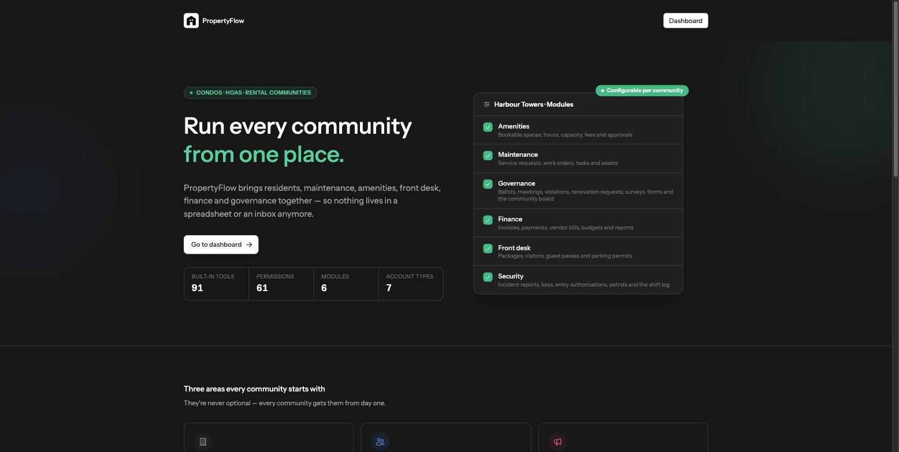
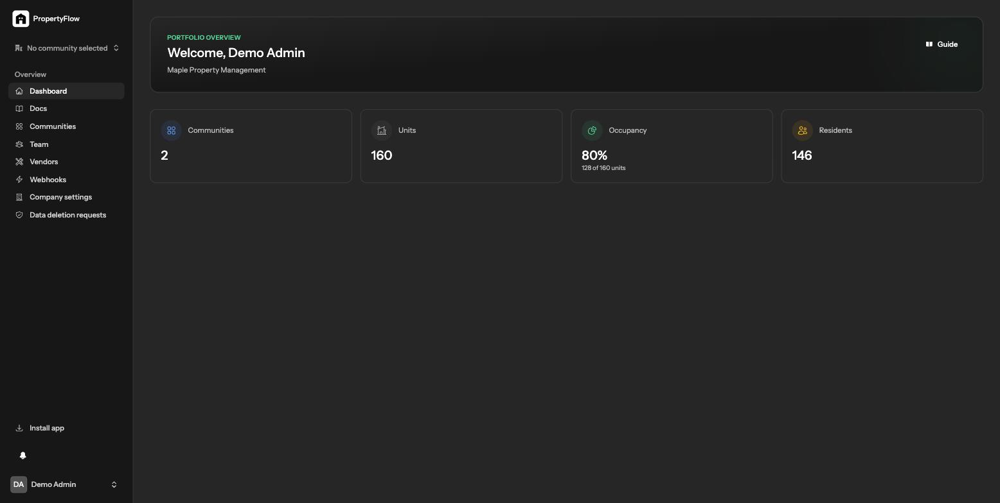
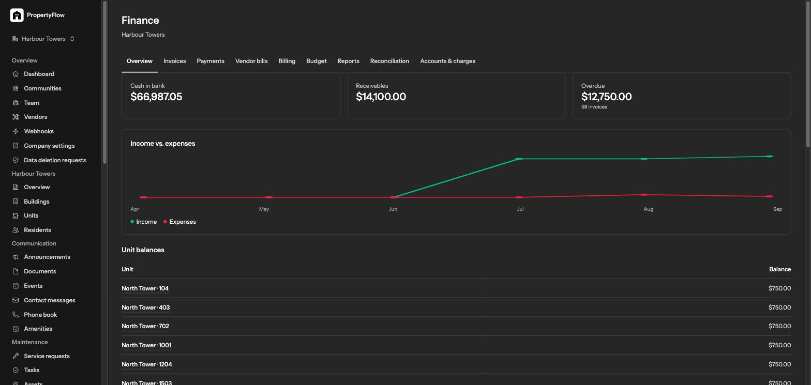
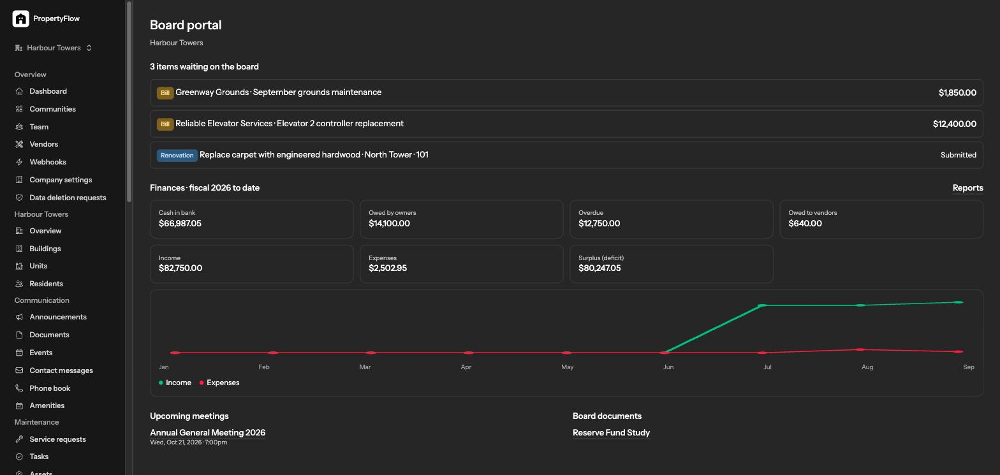
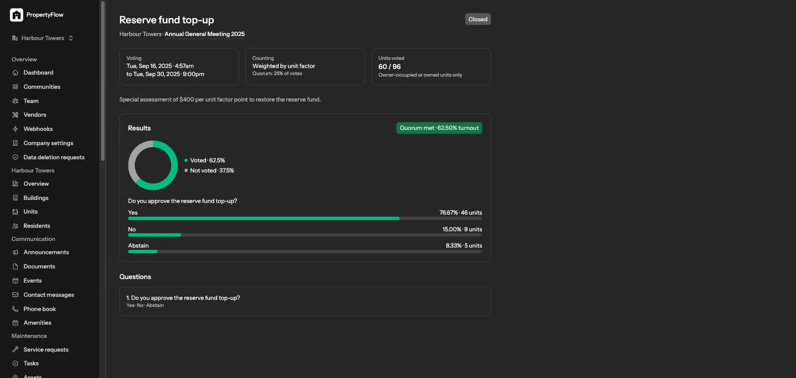

# PropertyFlow

> Run every condo, HOA or rental community from one place.

PropertyFlow is a multi-tenant SaaS platform for property management companies. One company account manages many communities — condos, HOAs, co-ops and rental buildings — and everyone touching that community (the management company, the board, residents, front-desk staff, and outside vendors) works from the same system instead of spreadsheets, paper logbooks and scattered email threads.

It's modelled on [Property Control](https://propertycontrol.com/) (the company behind Condo Control, HOA Central, HOA Sites and Patrol Points), built from scratch as a way to deeply understand the domain — not a copy of their code, a fresh implementation of the same problem.

[](https://github.com/Reyo77/property-flow/actions/workflows/tests.yml)


## Screenshots

| Landing page | Dashboard |
|---|---|
|  |  |

| Finance — income vs. expenses | Board portal |
|---|---|
|  |  |

| Ballot results |
|---|
|  |

## What it does

- **Residents & units** — the full record of every building, unit, owner and tenant, plus a self-service portal residents actually use.
- **Money & finance** — dues, invoices, vendor bills and budgets, with income-vs-expenses, aged-receivables and budget-vs-actual reports drawn as live charts.
- **Governance & voting** — weighted online ballots, proxy voting, meetings, and a board portal with a real financial snapshot instead of a PDF once a quarter.
- **Maintenance & operations** — service requests that route to staff or outside vendors, with a trail from reported to resolved, plus asset tracking.
- **Front desk & security** — packages, visitors, guest passes, parking permits, incident reports, keys, patrols and a shift log.
- **Communication** — announcements, events, a document library and a per-community public website.

Every community turns these six feature areas on or off independently — a rental building doesn't need a board portal; a self-managed HOA might not need front-desk tooling.

## Seven account types, seven views

The same app looks different depending on who's signed in — nobody sees more than their role needs:

| Role | What they see |
|---|---|
| **Company Admin** | Everything the company owns — every community, every dollar, every setting. |
| **Property Manager** | Full day-to-day control of the communities they're assigned. |
| **Board Member** | The board portal — real financials, approvals, and voting. |
| **Staff** | Front desk operations; can see voting results, not finance or the board portal. |
| **Resident** | Self-service — pay dues, vote, book amenities, raise requests. |
| **Vendor** | Only the work orders assigned to their company, across every community they serve. |
| **Platform Admin** | Oversees companies at the SaaS-operator level, independent of any one company. |

## Tech stack

- **Backend:** Laravel 13, Livewire 4 (class components), MySQL
- **Frontend:** Flux UI, Tailwind CSS v4, hand-rolled SVG charts (zero JS charting dependency)
- **Auth & permissions:** Laravel Fortify + passkeys, spatie/laravel-permission with teams keyed by company
- **Testing & quality:** Pest, PHPStan (Larastan) at level 8, Laravel Pint
- **Other:** spatie/laravel-backup, spatie/laravel-activitylog, Laravel Reverb (broadcasting), maatwebsite/excel, barryvdh/laravel-dompdf, knuckleswtf/scribe (API docs)

## Architecture highlights

- **Multi-tenancy** — a `Company` owns many `Community` records; every tenant-scoped model uses a shared `BelongsToCompany` trait, and every feature ships with a tenant-isolation test (another company's data must 404).
- **Real RBAC** — 61 granular permissions, checked via `$user->hasCompanyPermission()`, backed by spatie/laravel-permission teams scoped to `company_id`.
- **Money as integer cents** — every dollar amount flows through a small `Money` value object; no floating-point rounding in the finance module.
- **Modular by design** — six optional feature areas, toggled per community via the `Module` enum.
- **No external services yet, on purpose** — payments, email, SMS, push and AI are all behind interfaces with local drivers for now, so wiring up a real provider later is a matter of implementing one class, not restructuring the app.

## Getting started

This project is built to run on [Laravel Herd](https://herd.laravel.com/), but works with any standard Laravel setup.

```bash
composer install
npm install

cp .env.example .env
php artisan key:generate

# create a MySQL database named `property_flow`, then:
php artisan migrate --seed

npm run build   # or `npm run dev` while working on frontend changes
```

With Herd, the app is served automatically at `https://property-flow.test`. Otherwise, run `php artisan serve` and use the printed URL.

### Demo accounts

The seeder creates one demo company ("Maple Property Management") with a full year of realistic data, and one login per role. Every password is `password`.

| Role | Email |
|---|---|
| Company Admin | `demo@propertyflow.test` |
| Property Manager | `manager@propertyflow.test` |
| Board Member | `board@propertyflow.test` |
| Staff | `staff@propertyflow.test` |
| Resident | `resident@propertyflow.test` |
| Vendor | `vendor@propertyflow.test` |
| Platform Admin | `platform@propertyflow.test` |

## Testing & quality

```bash
composer test          # Pint (style) + PHPStan level 8 + Pest
vendor/bin/pint         # style only
vendor/bin/phpstan analyse
php artisan test --parallel
```

Every feature ships with a feature test, including a tenant-isolation test. Tests run against a real `property_flow_testing` MySQL database — no sqlite shortcuts. CI runs the same suite on every push and pull request via [GitHub Actions](.github/workflows/tests.yml).

## Project docs

Deeper planning and reference docs live in [`docs/`](docs/):

- [`01-product-overview.md`](docs/01-product-overview.md) — the product brief this was built from
- [`02-technical-plan.md`](docs/02-technical-plan.md) — architecture decisions
- [`04-implementation-plan.md`](docs/04-implementation-plan.md) — the phased build plan
- [`05-runbook.md`](docs/05-runbook.md) — operations runbook
- [`06-admin-guide.md`](docs/06-admin-guide.md) / [`07-resident-help.md`](docs/07-resident-help.md) — end-user guides

## What's not built yet

This is deliberately not production-hardened for a real paying customer yet:

- No live payment processor, transactional email, SMS or push provider — each sits behind an interface with a local/fake driver.
- No AI features (report drafting, communication drafting, automated reconciliation) — a real gap next to mature products in this space.
- English only; the codebase is i18n-ready (every string runs through `__()`) but no translations exist yet.
- No native mobile app — the web app is an installable PWA with an offline fallback page.

Built solo, end to end.
